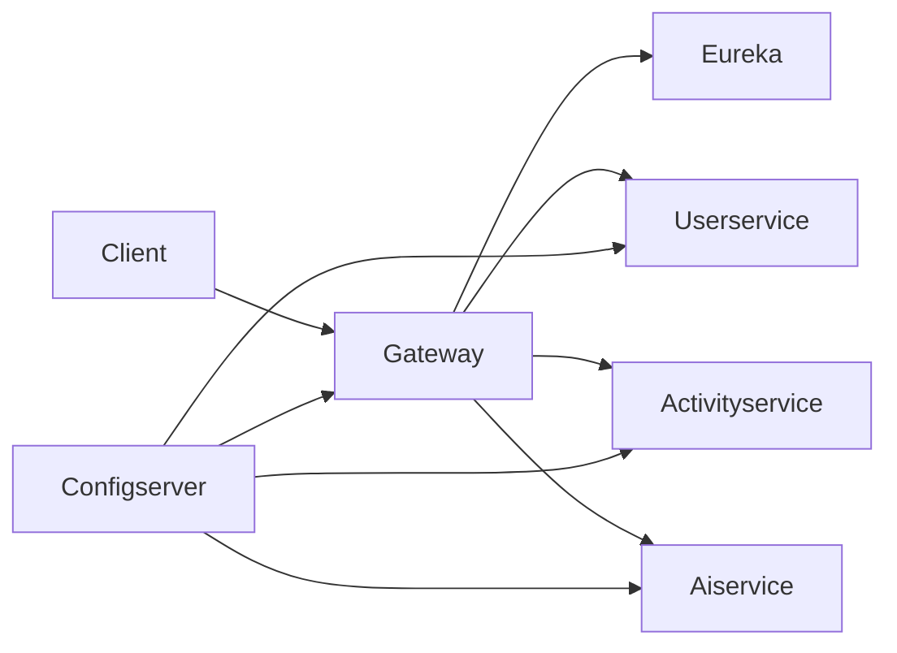

# 🏋️ Fitness Microservices Backend

This repository contains a **microservices-based fitness backend** built with Spring Boot, MongoDB, and Keycloak for authentication.  
It follows a modular architecture with separate services for user management, activity tracking, AI recommendations, and centralized configuration.

---

## 📂 Project Structure

- **activityservice/** → Manages fitness activities (CRUD, validation, MongoDB storage).
- **aiservice/** → AI-powered recommendations using Gemini + message listeners.
- **configserver/** → Centralized configuration management (Spring Cloud Config).
- **eureka/** → Service discovery (Netflix Eureka).
- **gateway/** → API Gateway with Keycloak integration, security filters, and user sync.
- **userservice/** → User management (registration, roles, persistence).

---

## 🛠 Tech Stack
- **Spring Boot** (REST APIs, microservices)
- **Spring Cloud** (Config Server, Eureka Discovery, Gateway)
- **MongoDB** (Activity & Recommendation storage)
- **Keycloak** (Authentication & Authorization)
- **WebClient** (Inter-service communication)
- **Gemini AI** (Recommendation engine)


## 🚀 Getting Started

### 1. Clone the repo
```bash
git clone https://github.com/SHREY9050/projects.git
cd projects/fitness-microservice-backend-app
```

### 2. Start Config Server
```bash
cd configserver
./mvnw spring-boot:run
```

### 3. Start Eureka Server
```bash
cd eureka
./mvnw spring-boot:run
```

### 4. Start Gateway
```bash
cd gateway
./mvnw spring-boot:run
```

### 5. Start User & Activity Services
```bash
cd userservice
./mvnw spring-boot:run

cd activityservice
./mvnw spring-boot:run
```

### 6. Start AI Service
```bash
cd aiservice
./mvnw spring-boot:run
```

---

## 🔑 Authentication
- Integrated with **Keycloak**.  
- Gateway applies `SecurityConfig` and `KeycloakUserSyncFilter`.  
- Users register via `userservice` → stored in DB → synced with Keycloak.

---

## 📖 API Endpoints (examples)

### User Service
- `POST /users/register` → Register new user  
- `GET /users/{id}` → Get user details  

### Activity Service
- `POST /activities` → Add activity  
- `GET /activities/{id}` → Get activity details  

### AI Service
- `GET /recommendations/{userId}` → Get personalized recommendations  

---

## 🏗 Architecture Diagram



---

## 📌 Notes
- Each service runs independently and registers with **Eureka**.  
- Configurations are centralized in **Config Server** (`application.yaml` + service-specific yml).  
- Gateway enforces **security** and routes requests.  
- AI service consumes activity data and generates recommendations.

---

© 2026 Shrey
```


